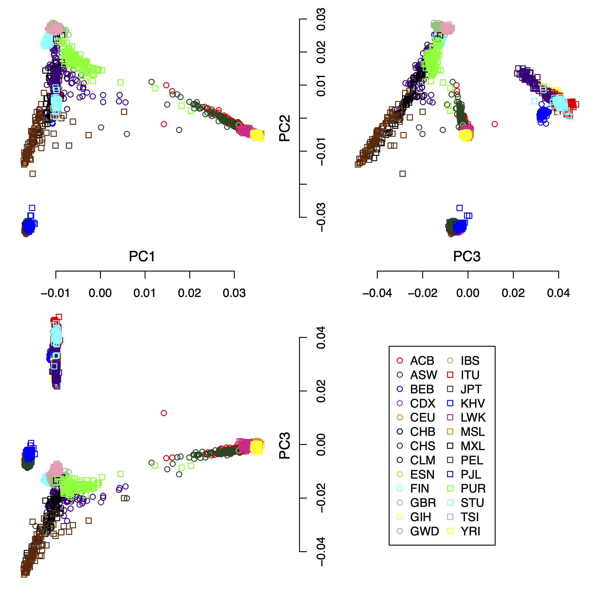
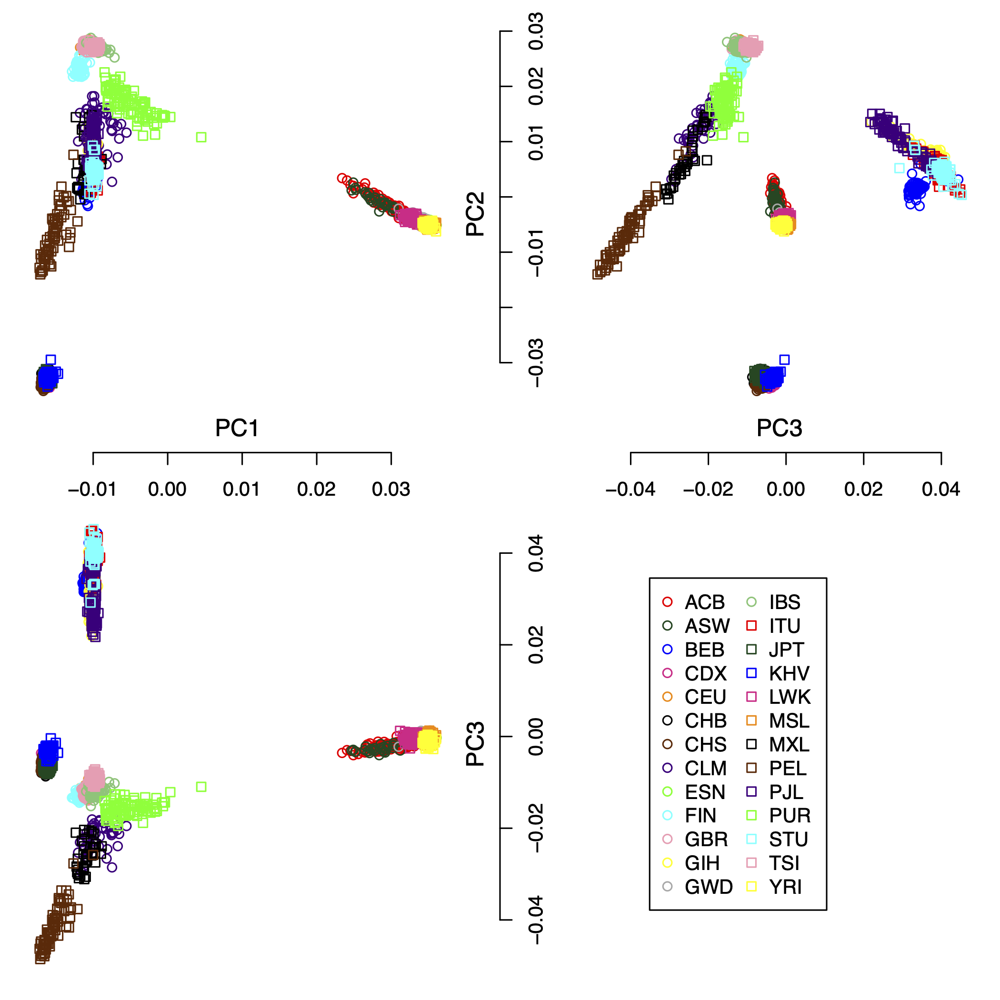
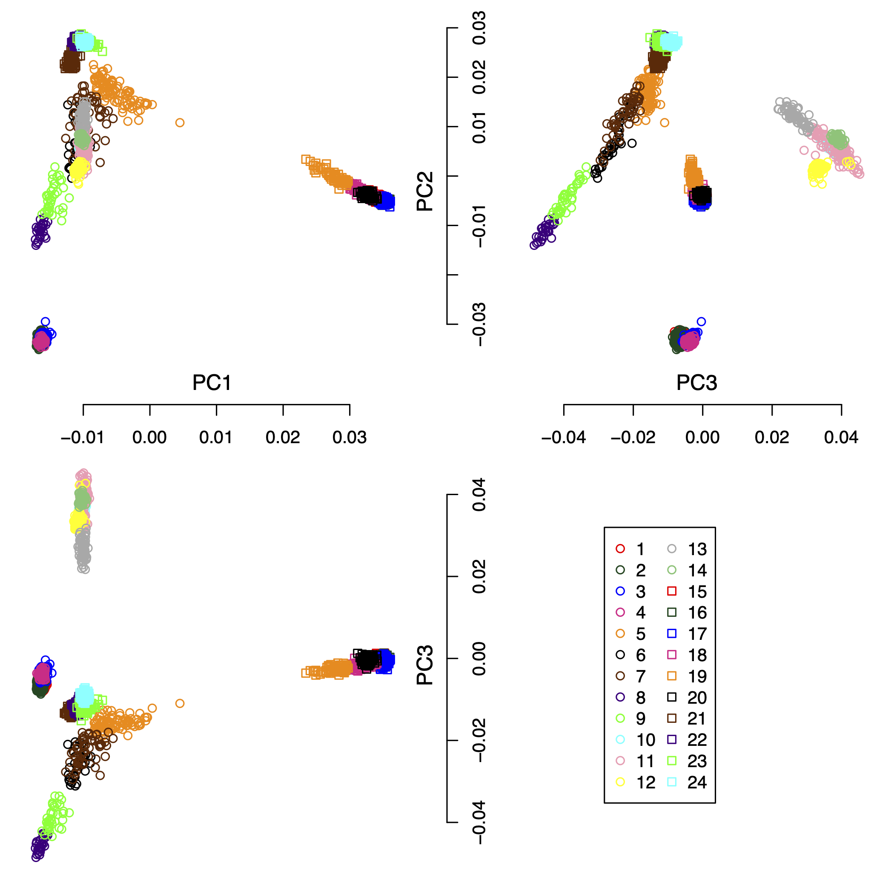
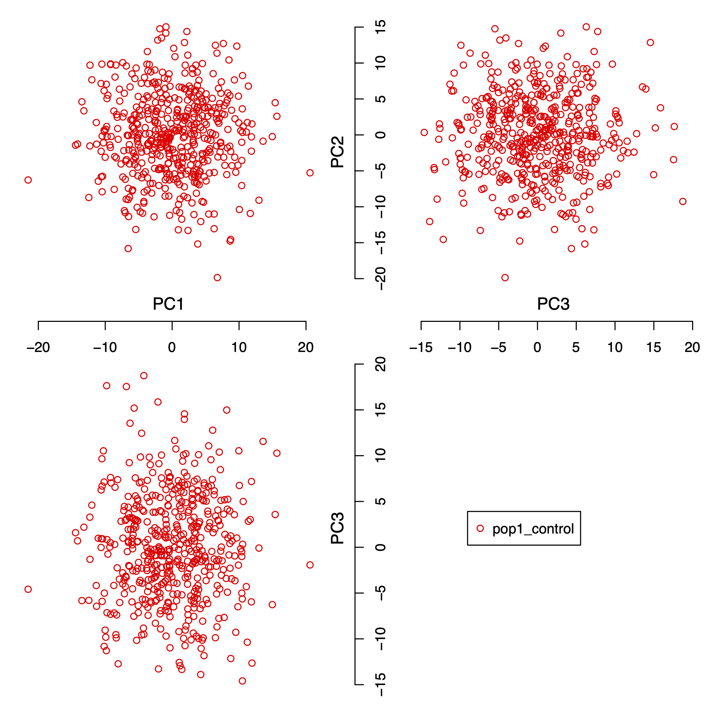
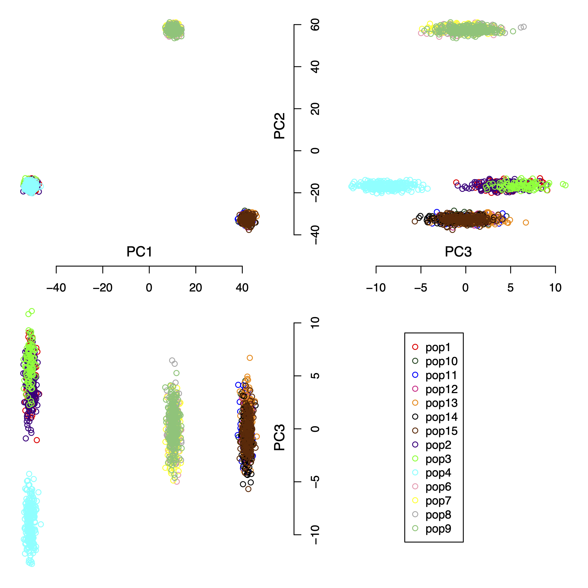
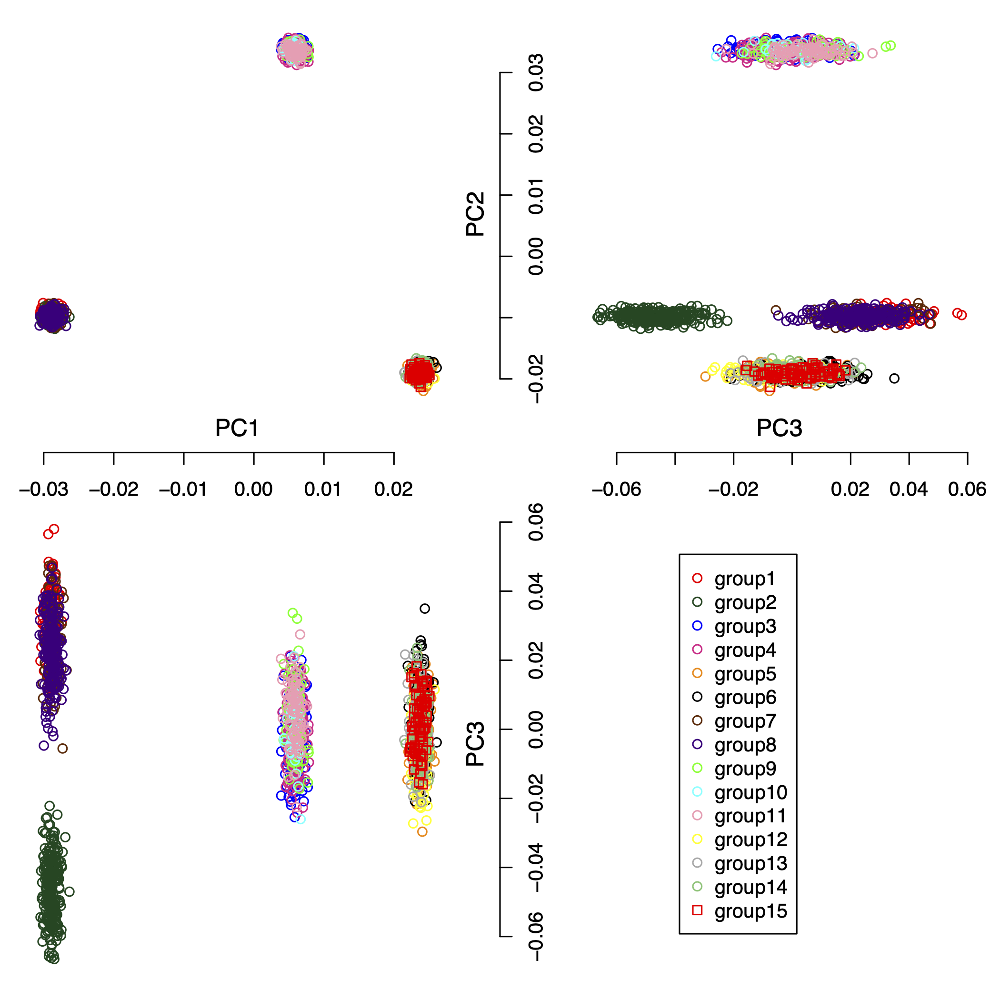

<font size="5">Fine-scale subpopulation detection via SNP-based unsupervised method: A case study on the 1000 Genomes Project Resources</font>

For the supplementary information of the paper, please check [](https://doi.org/10.5281/zenodo.7141144)

The page contains the extra information as:

1. Real-life scenario: the 1000 Genomes Project. This section contains the figures for principal component analysis and the output results from IPCAPS.
2. Simulated data set used to find the optimal Fixation Index as Threshold for fine-scale structure.
3. Complex simulated data set


## Real-life scenario: the 1000 Genomes Project

IPCAPS subtyping resulted in 24 groups (excluding the outliers). Figure 1 shows the first 3 principal components of all samples including the outliers with populations as labels. Figure 2 shows the first 3 principal components of all samples excluding the outliers with populations as labels. Figure 3 show the first 3 principal components of all samples excluding the outliers with the IPCAPS clusters as labels. For the result file, it consists of 28 columns (Table 1). The fist 3 columns are individual IDs, population labels, assigned clusters, and the first 25 principal components. The full result table can be downloaded from [here](data_1000g/PCA_1000G.csv).




Figure 1: the first 3 principal components of all samples including the outliers with populations as labels.




Figure 2: the first 3 principal components of all samples excluding the outliers with populations as labels.



Figure 3: the first 3 principal components of all samples excluding the outliers with the IPCAPS clusters as labels.


| Individual  | Population | Cluster | PC1                 | PC2                | PC3                 |
|-------------|------------|---------|---------------------|--------------------|---------------------|
| individual1 | GBR        | 22      | -0.0107380574672092 | 0.027763112230486  | -0.0128725996586141 |
| individual2 | GBR        | 22      | -0.0106240572135524 | 0.0276327017132276 | -0.0122091313249076 |
| individual3 | GBR        | 22      | -0.0110723121500444 | 0.0270967793266127 | -0.0113694771754151 |
| individual4 | GBR        | 22      | -0.0109009970688707 | 0.0277297792670736 | -0.0125973983735742 |
| individual5 | GBR        | 22      | -0.0109107684428465 | 0.0271314604934395 | -0.0127706893426669 |
| individual6 | GBR        | 22      | -0.011440781490344  | 0.0271660498293538 | -0.0116799608060983 |
| individual7 | GBR        | 22      | -0.0109098385167301 | 0.0271773381154484 | -0.0118470043335346 |
| individual8 | GBR        | 22      | -0.0107978960499085 | 0.027178628903619  | -0.0123339836623878 |
| individual9 | GBR        | 22      | -0.0107669661943635 | 0.0275825096725119 | -0.0109637054008316 |

Table 1: The first nine rows and the first six columns of the result table from the 1000 Genomes Project.


## Simulated data set for the optimal Fixation Index

As we explained in the supplementary section S3 (see [](https://doi.org/10.5281/zenodo.7141144)),  we simulated 100 replicates of one population with 5,000 SNPs and 500 individuals. Figure 4 shows the first 3 principal components of one of 100 simulated data set with this setting.



Figure 4: the first 3 principal components of one population with 5,000 SNPs and 500 individuals.

The simulated data files are provided in the PLINK format, which can be downloaded from:

1. [simSNP_rep1.bed](sim_data_optimal_fst/simSNP_rep1.bed)

2. [simSNP_rep1.bim](sim_data_optimal_fst/simSNP_rep1.bim)

3. [simSNP_rep1.fam](sim_data_optimal_fst/simSNP_rep1.fam)

4. [individual information](sim_data_optimal_fst/simSNP_rep1_individuals_with_header.txt)


## Complex simulated data set

We simulated a complex data set consisting of 15 populations, 2000 individuals, and 5,000 SNPs. The pair-wise Fst (Fixation Index) distances for all populations are shown in Table 2. Figure 5 shows the first 3 principal components of this complex simulated data set. For the result, the IPCAPS detects 15 clusters (see Figure 6). For the accuracy of IPCAPS on this complex data set, it can be calculated using Adjusted Rand Index (ARI) as

```{R}
library(mclust)
groups <- read.delim("sim_complex_data/IPCAPS_groups.txt")
ari <- adjustedRandIndex(groups$group, groups$label)
print(ari)
```

Note: The IPCAPS result can be downloaded from [here](sim_complex_data/IPCAPS_groups.txt)


|      |pop2 |pop3 |pop4 |pop9 |pop6 |pop7 |pop8 |pop10|pop11|pop12|pop13|pop14|pop15|
|------|-----|-----|-----|-----|-----|-----|-----|-----|-----|-----|-----|-----|-----|
|pop1  |0.002|0.004|0.005|0.220|0.220|0.222|0.223|0.215|0.214|0.216|0.216|0.216|0.216|
|pop2  |     |0.004|0.005|0.220|0.221|0.223|0.223|0.216|0.214|0.217|0.217|0.216|0.216|
|pop3  |     |     |0.007|0.222|0.223|0.224|0.225|0.219|0.217|0.220|0.219|0.219|0.219|
|pop4  |     |     |     |0.221|0.222|0.224|0.224|0.217|0.215|0.218|0.218|0.217|0.217|
|pop9  |     |     |     |     |0.002|0.003|0.005|0.216|0.217|0.219|0.218|0.218|0.218|
|pop6  |     |     |     |     |     |0.003|0.005|0.216|0.216|0.219|0.218|0.218|0.218|
|pop7  |     |     |     |     |     |     |0.006|0.218|0.219|0.221|0.220|0.220|0.220|
|pop8  |     |     |     |     |     |     |     |0.219|0.220|0.222|0.221|0.221|0.221|
|pop10 |     |     |     |     |     |     |     |     |0.003|0.005|0.004|0.005|0.003|
|pop11 |     |     |     |     |     |     |     |     |     |0.005|0.004|0.005|0.003|
|pop12 |     |     |     |     |     |     |     |     |     |     |0.006|0.007|0.005|
|pop13 |     |     |     |     |     |     |     |     |     |     |     |0.006|0.004|
|pop14 |     |     |     |     |     |     |     |     |     |     |     |     |0.005|

Table 2: The pair-wise Fst (Fixation Index) distances simulated populations.



Figure 5: the first 3 principal components of the complex simulated data set.



Figure 6: the first 3 principal components of the IPCAPS results.

The simulated data files are provided in the PLINK format, which can be downloaded from:

1. [simSNP_rep1.bed](sim_complex_data/simSNP_rep1.bed)

2. [simSNP_rep1.bim](sim_complex_data/simSNP_rep1.bim)

3. [simSNP_rep1.fam](sim_complex_data/simSNP_rep1.fam)

4. [individual information](sim_complex_data/simSNP_rep1_individuals_with_header.txt)


